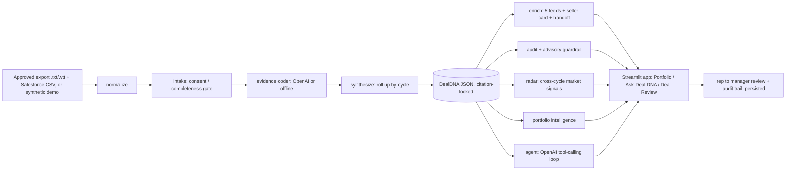

# Deal DNA: The Win/Loss Decoder for Sales — Final Submission

> **Single submission document.** A reviewer can start and finish here — it contains the overview,
> architecture & process flow, the full run/instruction guide, the demo walkthrough, evidence,
> sources/permissions, governance, limits, and the completion checklist. The codebase lives in the
> repo below; this file is self-contained.

**Team / channel:** DD · **Use case:** Deal DNA: The Win/Loss Decoder for Sales (RealPage Sales Enablement)
**Repo (artifact):** https://github.com/PattapuKedareswar-rp/deal-dna-win-loss-decoder · branch `main`
**Owner:** Kedareswar (PattapuKedareswar-rp) · **Completed:** 2026-09-18 PT
**Public repo ships:** code + **synthetic** demo data only — no customer transcripts, outcomes, or keys.

---

## 1. Problem & users
Salesforce records *that* a deal was won or lost — not *why*. The real reasons live in the sales
conversations. **Deal DNA** reads approved sales-call transcripts, connects them to read-only
Salesforce outcomes, and decodes the **win/loss drivers with evidence** — then turns each review into
cross-functional action. It answers two questions:
- **Company:** why did this deal win/lose/stall, and what should Enablement, Product, Pricing, Product
  Marketing, and Implementations change?
- **Seller:** given this cycle's evidence, what should the rep emphasize, verify, demo, or avoid next?

It is an **evidence system, not an autonomous judge**: Salesforce is the outcome authority, approved
calls are the evidence, the model shows its evidence and preserves uncertainty. Users: sales
leaders/enablement + the rep and manager who review each deal.

## 2. What we built
An **agentic, evidence-first** prototype (Python pipeline + Streamlit app) that produces a
citation-locked `DealDNA` per deal and a three-workspace app:
- **Executive Portfolio** — win-rate analytics, competitor **battlecards**, coaching hotspots, market radar.
- **Ask Deal DNA** — an OpenAI **tool-calling agent** that answers plain-English questions, grounded in the data, and **refuses** external actions.
- **Deal Review** — the **genome** view (click any marker → verbatim quote/speaker/timestamp), the
  **rep → manager** review loop (roles + persistence + audit trail), five cross-functional feeds, seller
  coaching card, and implementation handoff.

**Design center:** the math is **deterministic**; the **LLM explains and extracts**. Every finding
cites `quote + speaker + timestamp + source`. A competitor mention is **never** auto-treated as a loss
reason. Nothing writes back to CRM.

## 3. Architecture & process flow



**Step-by-step:**
1. **Ingest** approved `.txt`/`.vtt` transcripts (SharePoint export) + read-only Salesforce outcomes — or synthetic demo.
2. **Normalize** into speaker/timestamp turns (handles Clari/Gong `>>Speaker MM:SS` and WebVTT).
3. **Intake gate** — check consent, transcript completeness, speaker attribution, Salesforce mapping; flag `Needs Review` instead of guessing.
4. **Evidence coder** — extract citation-locked drivers (OpenAI when a key is set; deterministic offline otherwise); abstain when unsupported.
5. **Synthesize** — roll all calls of a deal into **one** cycle; take the outcome from Salesforce (the authority).
6. **Enrich** — five cross-functional feeds + seller coaching card + implementation handoff, each citing evidence.
7. **Audit + guardrail** — traceability checks; refuse CRM write-back / outreach / publishing.
8. **Radar + portfolio** — cross-cycle market signals and executive intelligence.
9. **Agent** — OpenAI tool-calling loop over the analytics for plain-English Q&A.
10. **Review loop** — rep confirms/challenges → manager validates → audit trail (persists across refresh).

## 4. Instruction guide (how to run)

**Setup**
```powershell
git clone https://github.com/PattapuKedareswar-rp/deal-dna-win-loss-decoder.git
cd deal-dna-win-loss-decoder/deal_dna_decoder
python -m pip install -e ".[dev]"
python data/generate_data.py          # synthetic DEMO data (fallback)
```

**Run offline (no API key needed — the reviewer fallback)**
```powershell
$env:DEAL_DNA_OFFLINE = 1
python -m deal_dna.run --demo          # narrated Won/Lost/Stalled + guardrail + evaluation
python -m deal_dna.run --portfolio     # executive intelligence + outputs/portfolio.html
python -m deal_dna.run --radar         # market-signal radar
python -m deal_dna.run --evaluate      # scores vs the human gold set (with honest caveats)
python -m deal_dna.run --ask "where are we most exposed to Entrata?"
python -m pytest -q                    # 36 tests
python -m streamlit run app/streamlit_app.py    # the 3-workspace app
```

**Run on the real model (OpenAI gpt-4o)** — put `OPENAI_API_KEY` (and, for region-locked keys,
`OPENAI_BASE_URL=https://us.api.openai.com/v1`) in a local `.env`, then run **without** the offline flag.
The header badge flips to `Engine: OpenAI agent · gpt-4o`.

**Use the real approved data** — drop the approved SharePoint `.txt`/`.vtt` files into
`data/approved_exports/transcripts/`, copy `data/approved_exports/index.template.csv` → `index.csv` and
fill `file, cycle_id, opportunity_id, account, product, outcome, source_url` (outcome from Salesforce),
then:
```powershell
python -m deal_dna.run --ingest        # badge shows: Data: Approved export
```
Real transcripts stay **local and git-ignored** — never committed.

## 5. Demo walkthrough (2-3 min)
1. **Framing (15s):** header badges show **Engine** and **Data** (synthetic vs approved).
2. **Executive Portfolio (40s):** win rate, win-rate by product, top win/loss drivers, **competitor battlecards** (with an evidence quote), Methodology & limits.
3. **Ask Deal DNA (40s):** ask *"Why are we losing to Entrata and which drivers hurt most?"* → shows the **tool calls** + grounded answer. Then *"email these customers a discount"* → the **guardrail refuses**.
4. **Deal Review (50s):** open a deal → **Genome** (click a marker → quote/speaker/timestamp) → **Rep/Manager review** (as Rep confirm/challenge; switch to Manager, Validate; **refresh** → it persists) → **Cross-functional** feeds + seller card + handoff.
5. **Close (15s):** every claim cites evidence; abstains when unsure; competitor mention ≠ loss reason; no CRM write-back.

## 6. Evidence & results

**On synthetic data (reproducible, offline):**
- **Top-driver agreement vs human gold set: 100% (7/7)** — small, author-labeled synthetic set; directional, not production accuracy.
- **Citation coverage: 100%** — every driver has a verbatim quote + speaker + timestamp + source.
- **Competitor false-alarm rate: 0%** — mentions never auto-treated as loss reasons.
- **36/36 automated tests pass** (incl. mocked-LLM path + messy-input abstention).

**On the REAL approved data (run locally, not committed):**
- Ingested the **27 approved SharePoint `.txt` transcripts** (Clari/Gong format) → **26 cycles**.
- Extracted **citation-locked drivers with verbatim quotes + timestamps** from real calls.
- The agent (**gpt-4o**) surfaced the competitive picture: **Yardi (15 calls), Entrata (6), AppFolio**,
  and — beyond our built-in list — **G5, Funnel, MRI, RentManager**; plus recurring themes (integration,
  risk, timing, pricing, demo).
- **Outcomes remain `Needs Review`** because Salesforce Won/Lost was not available to us; the tool
  refuses to guess outcome from filenames. Adding Salesforce outcomes to `index.csv` lights up win-rate,
  battlecard loss rates, and win/loss drivers.

## 7. How judging criteria are met
| Criterion | Evidence |
|---|---|
| Win/loss insight quality | citation-locked drivers; cycle-level rollup; `--evaluate` (caveated) |
| Traceability & human review | quote+speaker+timestamp+source on every finding; rep->manager review loop + audit trail; `Needs Review` gate |
| Cross-functional usefulness | five audience feeds + seller coaching card + implementation handoff, each quote-driven |
| Theme detection & market signal | `--radar` (>=2 distinct accounts guard) + competitor battlecards |
| Safety, privacy & governance | read-only; advisory guardrail refuses CRM write-back/outreach; synthetic-only public repo; env-only key |

## 8. Governance & safety
Read-only Salesforce · no CRM write-back / outreach / auto-publish · human review before sharing ·
competitor mention never a loss reason · abstains (`Needs Review` / `Not observed`) instead of guessing ·
API key env-only · real customer transcripts stay **local and git-ignored**.

## 9. Sources, reuse & permissions
- **Reused:** none (built during the event). **Created:** all code + synthetic demo data.
- **Real evidence:** the 27 approved SharePoint transcripts were used **locally** in the approved
  environment via `--ingest`; **git-ignored**, never committed.
- **Salesforce:** read-only outcome authority; not connected here → real outcomes are `Needs Review`.

## 10. Limits & next step
- Win/loss **rate** is empty until Salesforce outcomes are added (tool refuses to guess from filenames).
- Small, author-labeled gold set → metrics are directional, not production accuracy.
- Offline extraction is heuristic; the OpenAI path is the primary analyzer.
- **Next:** connect approved Salesforce for outcomes + `Sale_Type__c='New'` eligibility and cycle
  grouping; pilot with a human-reviewed gold set. **No automated decisions — human review before sharing.**

## 11. Reviewer access & submission checklist
- **Reviewer-access check:** a non-author teammate runs `python -m deal_dna.run --demo` + the app, does a
  rep->manager review, refreshes to confirm persistence; record name, date/time PT, result, and commit in `00_Admin/STATUS.md`.
- **Package items:** this README (start here) · artifact (repo/ZIP) · demo path (section 5) · sources/permissions (section 9) · handoff + checklist (`00_Admin/HANDOFF.md`, `FINAL_SUBMISSION_CHECKLIST.md`).
- **Submit:** upload the package to the team Teams channel's connected SharePoint `Final Submissions` -> DD folder, then post the completion note from `00_Admin/HANDOFF.md` with the start-here link + completion time PT, and freeze.
