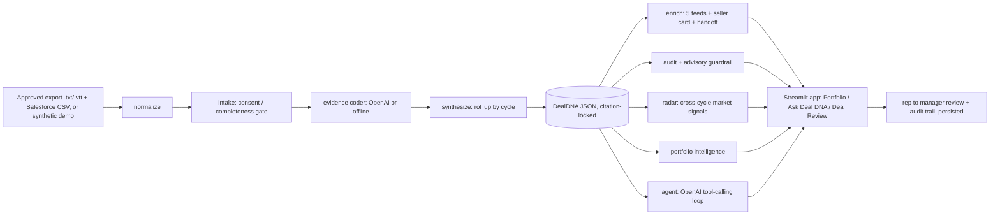

# Deal DNA: The Win/Loss Decoder for Sales — Final Submission

**Team channel:** DD · **Use case:** Deal DNA: The Win/Loss Decoder for Sales (RealPage Sales Enablement)
**Repo:** https://github.com/PattapuKedareswar-rp/deal-dna-win-loss-decoder · branch `main`
**Data:** SYNTHETIC sample data only — not real customer data.

## Start here
1. `cd deal_dna_decoder && python -m pip install -e ".[dev]"`
2. `python data/generate_data.py`
3. `$env:DEAL_DNA_OFFLINE = 1` then `python -m deal_dna.run --demo`

The `--demo` command is the guided walkthrough (a Won, a Lost, and a Stalled cycle, plus the guardrail
and the evaluation scorecard). It runs **offline with no API key** — the reviewer fallback.

## Problem & user
Salesforce picklists record *that* a deal was won or lost, but not *why*. The real reasons live in
sales-call conversations. **Deal DNA** reads approved call transcripts, connects them to read-only
Salesforce outcomes, and decodes the win/loss drivers with evidence — for Sales Enablement, Product,
Pricing, Product Marketing, and Implementations. Primary users: sales leaders/enablement + the rep and
manager who review each deal.

## What we built
An **agentic, evidence-first pipeline** that produces a citation-locked `DealDNA` per deal:
`normalize → intake (consent/provenance gate) → evidence coder → cycle synthesizer`, plus `audit`
(traceability + advisory-only guardrail), `radar` (cross-cycle market signals), and `evaluate`
(scoring vs a human gold set). Runs on **OpenAI (gpt-4o)** or fully **offline/deterministic**.
Person B adds the five cross-functional feeds, the **Deal DNA genome** view, and the rep→manager
review loop (integrated through a fixed seam).

## Architecture

**Pipeline:** transcripts → normalize → intake gate → evidence coder → cycle synthesizer → citation-locked
`DealDNA` → enrichment (feeds/coach/handoff) + audit/guardrail + radar + portfolio + agent → app + review loop.
The math is deterministic; the LLM explains and extracts. Salesforce is the outcome authority; a competitor
mention is never auto-treated as a loss reason; nothing writes back to CRM.

## Demonstrated result (measured on synthetic data)
- **Top-driver agreement vs human gold set: 100% (7/7)** — small, author-labeled synthetic gold set;
  directional, not production accuracy.
- **Citation coverage: 100%** — every driver carries a verbatim quote + speaker + timestamp + source.
- **Competitor false-alarm rate: 0%** — a competitor mention is never auto-treated as a loss reason.
- **36/36 automated tests pass** (incl. mocked-LLM path + messy-input abstention). Live OpenAI path +
  offline fallback both verified.

## Validated on the REAL approved data (run locally, not committed)
We ingested the **27 approved SharePoint `.txt` transcripts** (Clari/Gong format) into 26 cycles via
`--ingest` and ran the pipeline:
- Extracted **citation-locked drivers with verbatim quotes + timestamps** from real calls.
- The agent (real **gpt-4o**) surfaced the **competitive picture**: Yardi (15 calls), Entrata (6),
  AppFolio, and — beyond our built-in list — **G5, Funnel, MRI, RentManager**; plus recurring themes
  (integration, risk, timing, pricing, demo).
- **Outcomes remain `Needs Review`** because Salesforce Won/Lost was not available to us — the tool
  refuses to guess outcome from filenames (per the brief). Adding Salesforce outcomes to the index
  lights up win-rate, battlecard loss rates, and win/loss drivers.
- Raw transcripts stay **local and git-ignored** — never pushed to the public repo.

## Reviewer access check
Runs with no credentials in offline mode. A non-author teammate should follow `DEMO_SCRIPT.md`, run a
rep→manager review in the app, refresh to confirm it persists, and record: reviewer name, date/time PT,
result, and commit. See `00_Admin/STATUS.md` for the evidence log.

## How judging criteria are met
| Criterion | Evidence |
| --- | --- |
| Win/loss insight quality | `--evaluate`: 100% top-driver agreement; cycle-level rollup (not per call) |
| Traceability & human review | Citation-locked drivers; rep→manager review loop + audit trail; `Needs Review` gate |
| Cross-functional usefulness | Five audience feeds + seller coaching card + implementation handoff (Person B) |
| Theme detection & market signal | `--radar` recurring hesitations + alternative-software mentions with a false-alarm guard |
| Safety, privacy & governance | Read-only; advisory guardrail refuses CRM write-back/outreach; synthetic data; env-only key |

## Review access & demonstration path
- No credentials needed: run offline (`DEAL_DNA_OFFLINE=1`) → `python -m deal_dna.run --demo`.
- Live path: set `OPENAI_API_KEY` in a local `.env` (never committed), `DEAL_DNA_OFFLINE=0`.
- Evidence log with T-01/T-02/T-03 results: `00_Admin/STATUS.md`.

## Sources, reuse & permissions
- **Reused:** none (built during the event). **Created:** all code + synthetic demo data.
- **Real evidence:** the 27 approved SharePoint transcripts (Deal DNA — Transcripts folder) were used
  **locally** in the approved environment via `--ingest`; they are **git-ignored** and never committed.
- Read-only **Salesforce** is the outcome authority; not connected here, so outcomes are `Needs Review`.
- The public repo contains **only code + synthetic data** — no customer transcripts, outcomes, or keys.

## Limits & next step
- Synthetic data is a pilot/taxonomy, not a production predictive model.
- Offline extraction is heuristic; the OpenAI path is the primary analyzer.
- **Next:** connect approved SharePoint/Salesforce sources behind the same schema; pilot with a
  human-reviewed gold set. **No automated decisions — human review before anything is shared.**

## Recommended next step / owner
Integrate Person B's review UI end-to-end (Sync 3), then run the MVP demo for reviewers. Owner: team.
